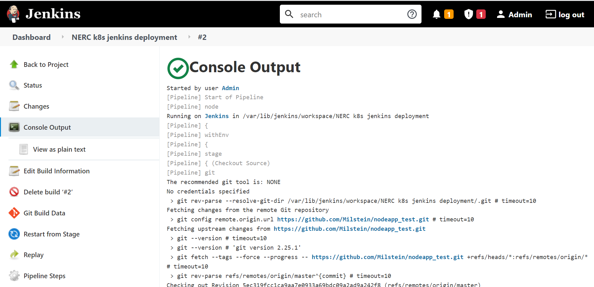

# How to setup CI/CD Pipelines on NERC's OpenStack

This document will walk you through how to setup a minimal **"CI/CD Pipeline To Deploy
To Kubernetes Cluster Using a CI/CD tool called Jenkins"** on your NERC's OpenStack
environment. Jenkins uses the Kubernetes control plane on K8s Cluster to run pipeline
tasks that enable DevOps to spend more time coding and testing and less time
troubleshooting.

!!! note "Prerequisite"
    You need Kubernetes cluster running in your OpenStack environment. To setup your
    K8s cluster please [Read this](/openstack/kubernetes/kubernetes/).


*Figure: CI/CD Pipeline To Deploy To Kubernetes Cluster Using Jenkins on NERC*

Please follow the following steps:

- Install a Jenkins Server on one of your Worker Node on your K8s Cluster. This will
act as both Jenkins master and slave in this case. But you can just setup a Jenkins
Slave online on one of your K8s worker node too and separate the master to an external
OpenStack Instance.

After [SSH'ing](../create-and-connect-to-the-VM/bastion-host-based-ssh/index.md)
to your worker node where you want to install the Jenkins server, To install a
Jenkins server using Docker run the following command:

```ssh
docker run -u 0 --privileged --name jenkins -it -d -p 8080:8080 -p 50000:50000 \
    -v /var/run/docker.sock:/var/run/docker.sock \
    -v $(which docker):/usr/bin/docker \
    -v /home/jenkins_home:/var/jenkins_home \
    jenkins/jenkins:latest
```

Wait until you get the secret that act as the initial Administrator password to
unlock Jenkins web UI running on port: 8080

- Once you login to the Jenkins Web UI by entering the admin password shown on CLI
terminal, click on the "Install suggested plugins" button.

- Create First Admin User with username and password and then it will give Jenkins
URL to browse.

- Install some required Jenkins plugins:
    1. Docker pipeline, and
    2. Kubernetes Continuous Deploy

- Create a global credential for your Docker Hub Registry by providing the username
and password that will be used by the Jenkins pipelines:

    1. Click on the "Manage Jenkins" menu and then click on the "Manage Credentials"
    link.
    2. Select the Kind "Username and password" from the dropdown options.
    3. Provide your Docker Hub Registry's username and password.
    4. Give its ID and description. which you will need to be specify on your Jenkinsfile.

- Config the kube config from K8s master as a new Credential:

    1. Click on the "Manage Jenkins" menu and then click on the "Manage Credentials"
    link.
    2. Select the Kind "Kubernetes configuration (kubeconfig)" from the dropdown
    options.
    3. Give a ID and description that you will need to use on your Jenkinsfile.
    4. On **Kubeconfig** section select "Enter directly".
    5. Copy content from your K8s master’s kubeconfig file located at: `/etc/kubernetes/admin.conf`.

- Write a Jenkins Pipeline Script file named as ‘**Jenkinsfile**’ as following:

```sh
pipeline {

  environment {
    dockerimagename = "milstein/nodeapp"
    dockerImage = ""
  }

  agent any

  stages {

    stage('Checkout Source') {
      steps {
        git branch: 'main', url: 'https://github.com/Milstein/nodeapp.git'
      }
    }

    stage('Build image') {
      steps{
        script {
          dockerImage = docker.build dockerimagename
        }
      }
    }

    stage('Pushing Image') {
      environment {
               registryCredential = 'dockerhublogin'
           }
      steps{
        script {
          docker.withRegistry('https://registry.hub.docker.com', registryCredential){
            dockerImage.push("latest")
          }
        }
      }
    }

    stage('Deploying App to Kubernetes') {
      steps {
        script {
          kubernetesDeploy(configs: "deploymentservice.yml", kubeconfigId: "kubernetes")
        }
      }
    }
  }
}
```

This Jenkinsfile will checkout git repo from your application github repo. For
example, in this case we are using: `https://github.com/Milstein/nodeapp` as
our git repo where our Node.js application resides. `dockerhublogin` is the ID
given during the credential saving steps mentioned above. Similarly, `kubernetes`
is the ID given for Kubeconfig credential.

!!! note "Note"
    You can generate your custom Jenkinsfile by clicking on **"Pipeline Syntax"**
    link shown when you create a new Pipeline when clicking the "New Item" menu link.

- Once your Jenkinsfile is ready and reviewed you can now create a pipeline to
trigger it on your newly setup Jenkins server:

    1. Click on the "New Item" link.
    2. Select the "Pipeline" link.
    3. Give name to your Pipeline i.e. “*Jenkins to K8s pipeline*”
    4. Select "Pipeline" tab and then copy/paste the content of your Jenkinsfile
    on the given textbox. Please make sure you are selecting the "Pipeline script"
    from the dropdown options.

- Finally, click on the **"Build Now"** menu link on right side navigation that will
triggers the Pipeline process i.e. Build docker image, Push Image to your Docker
Hub Registry and Pull the image from Docker Registry and Deploy to K8s Cluster.
You can see the Console Output logs of this pipeline process by clicking the icon
before the id of the started Pipeline on the right bottom corner.



We will continue on [next documentation](integrate-your-GitHub-repository.md) on
how to setup GitHub Webhook in your Jenkins Pipeline so that Jenkins will trigger
the build when a devops commits code to your GitHub repository's specific branch.

---
